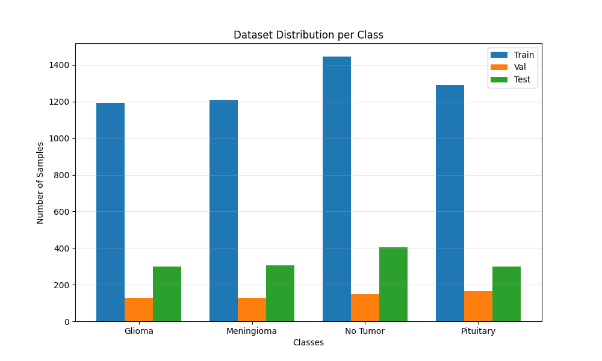
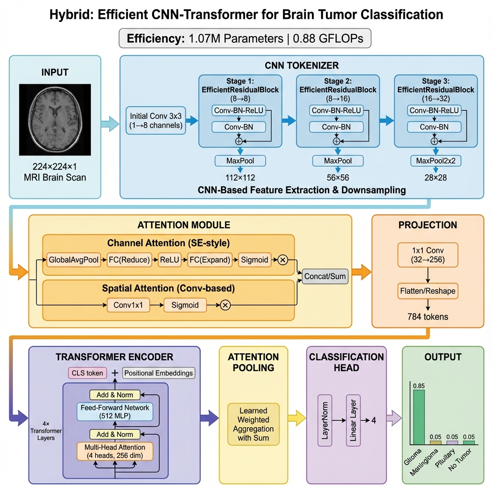
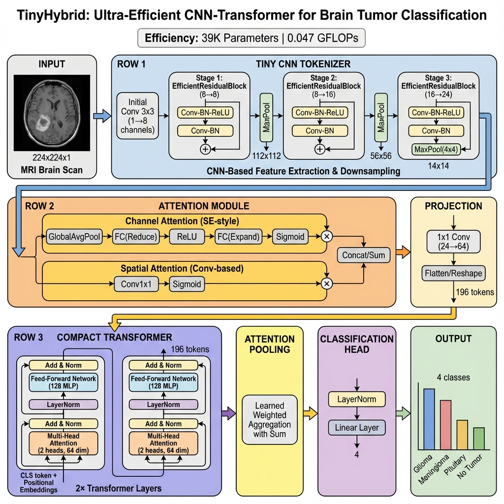
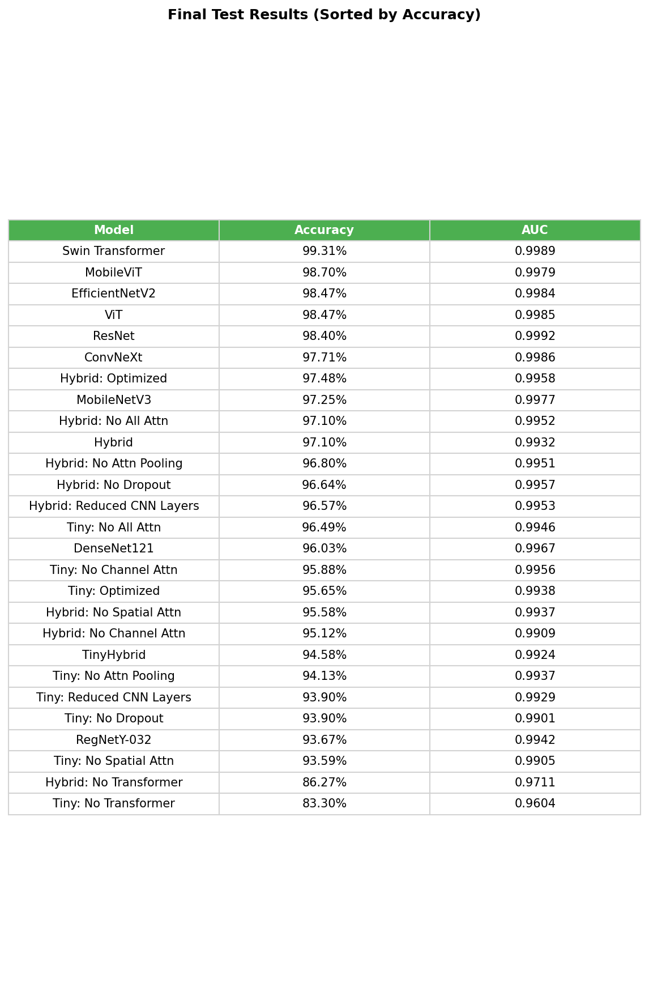
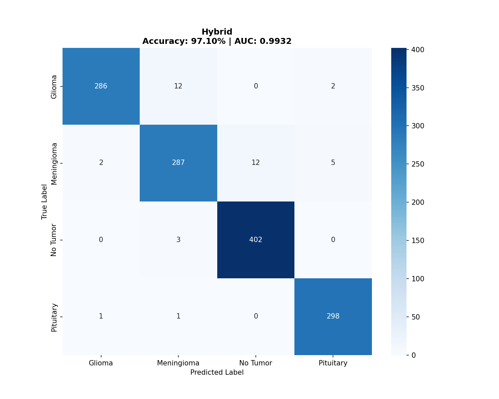
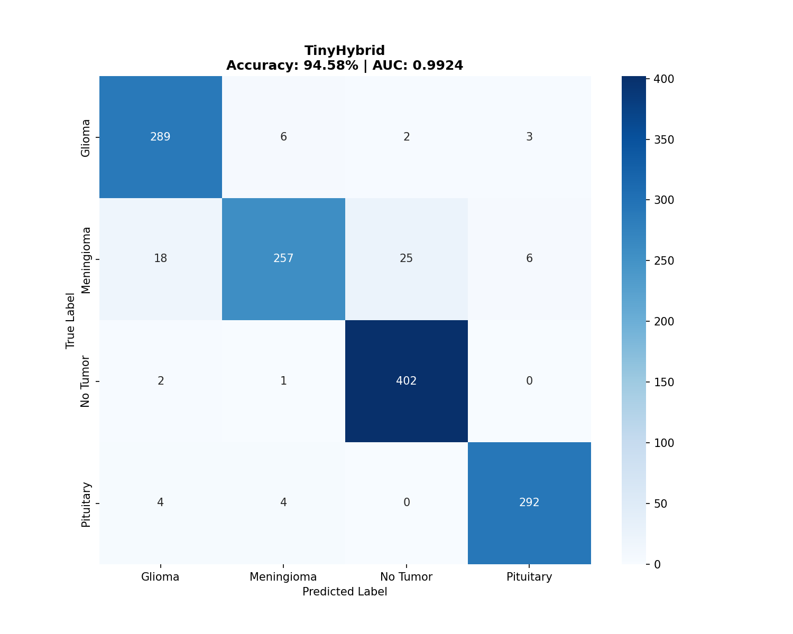
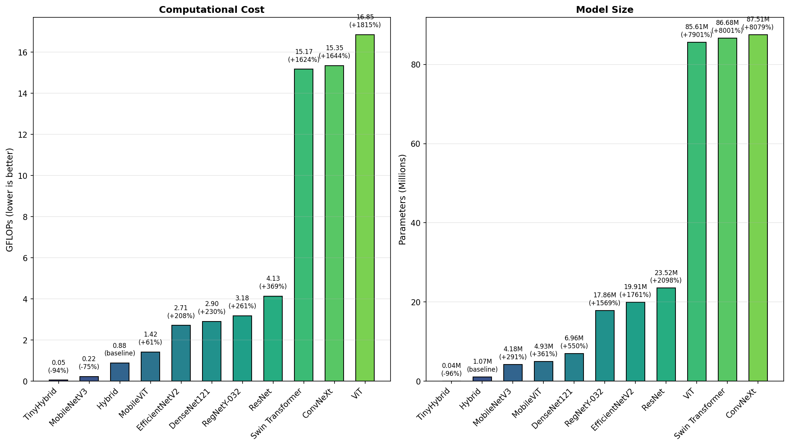
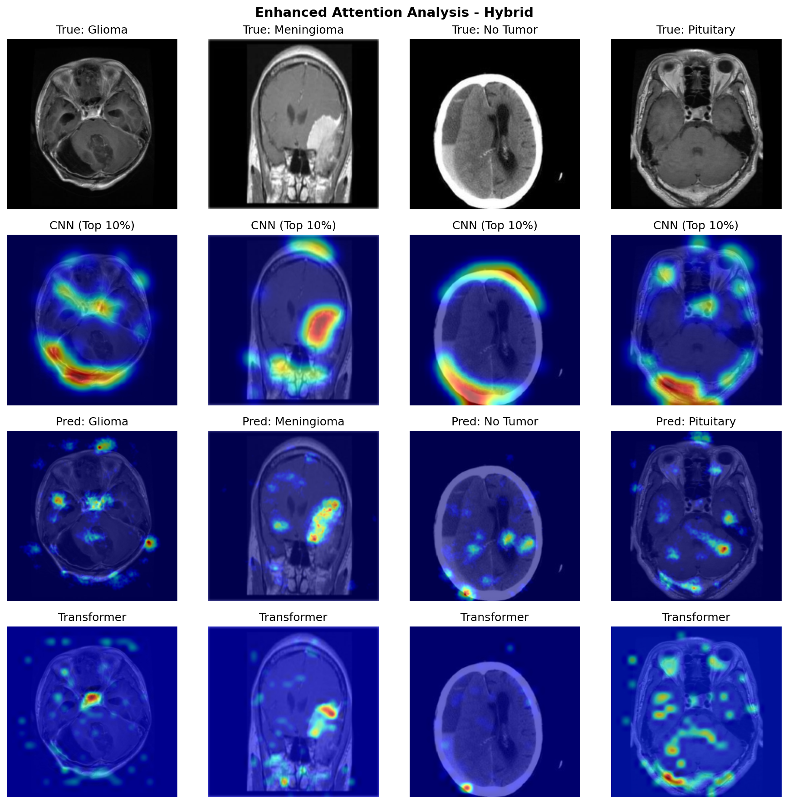

# TinyHybrid: Efficient CNN-Transformer Hybrid Architecture for Brain Tumor Classification

## Abstract

This work presents TinyHybrid, an ultra-efficient hybrid CNN-Transformer architecture designed for brain tumor classification from MRI images. While state-of-the-art models such as Swin Transformer achieve high accuracy, they require substantial computational resources (86.7M parameters, 15.2 GFLOPs), limiting their applicability in resource-constrained clinical settings. Our proposed TinyHybrid achieves competitive classification performance (94.58% accuracy, 0.992 AUC) while requiring only **39K parameters** and **0.047 GFLOPs**—representing a **2,200x reduction in parameters** and **323x reduction in computational cost** compared to Swin Transformer. Additionally, we present a full-scale Hybrid model that achieves 97.10% accuracy with 1.07M parameters and 0.88 GFLOPs, offering an excellent trade-off between performance and efficiency. Comprehensive ablation studies validate the contribution of each architectural component, including channel attention, spatial attention, transformer encoder, and attention pooling mechanisms.

---

## Table of Contents

1. [Introduction](#introduction)
2. [Dataset](#dataset)
3. [Methodology](#methodology)
   - [Architecture Overview](#architecture-overview)
   - [Hybrid Model](#hybrid-model)
   - [TinyHybrid Model](#tinyhybrid-model)
   - [Training Methodology](#training-methodology)
4. [Experimental Results](#experimental-results)
   - [Performance Comparison](#performance-comparison)
   - [Computational Efficiency](#computational-efficiency)
   - [Ablation Studies](#ablation-studies)
   - [Cross-Dataset Generalization](#cross-dataset-generalization)
5. [Interpretability Analysis](#interpretability-analysis)
6. [Installation and Usage](#installation-and-usage)
7. [Project Structure](#project-structure)
8. [Citation](#citation)

---

## Introduction

Brain tumor classification from MRI scans is a critical task in medical diagnostics, where accurate and timely diagnosis can significantly impact patient outcomes. While deep learning approaches have demonstrated remarkable success in this domain, state-of-the-art models often require extensive computational resources, presenting challenges for deployment in clinical environments with limited hardware infrastructure.

This work addresses this gap by proposing efficient hybrid CNN-Transformer architectures that achieve competitive accuracy while dramatically reducing computational requirements. Our key contributions include:

1. **TinyHybrid**: An ultra-efficient model with only 39K parameters achieving 94.58% accuracy
2. **Hybrid**: A balanced model with 1.07M parameters achieving 97.10% accuracy
3. **Comprehensive ablation studies** validating the contribution of each architectural component
4. **Multi-level interpretability analysis** including attention maps, GradCAM, and SHAP visualizations

---

## Dataset

We evaluate our models on the publicly available Brain Tumor MRI Dataset, comprising MRI scans across four diagnostic categories.

### Dataset Statistics

| Split | Total | Glioma | Meningioma | No Tumor | Pituitary |
|-------|-------|--------|------------|----------|-----------|
| Training | 5,712 | 1,321 | 1,339 | 1,595 | 1,457 |
| Testing | 1,311 | 300 | 306 | 405 | 300 |
| **Total** | **7,023** | **1,621** | **1,645** | **2,000** | **1,757** |

### Class Distribution



The dataset exhibits near-balanced class distribution, with the No Tumor class being slightly more represented. Training images are further split into 90% training and 10% validation sets for model development.

### Preprocessing Pipeline

- **Resolution**: All images resized to 224x224 pixels
- **Channels**: Grayscale (1 channel) for our hybrid models; RGB (3 channels) for pretrained baselines
- **Normalization**: Mean=0.5, Std=0.5 for grayscale; ImageNet statistics for RGB

### Data Augmentation

Training augmentation includes:
- Random horizontal flip
- Random rotation (±15 degrees)
- Random affine transformation (translation: 5%, scale: 95-105%)
- Gaussian blur (10% probability)

---

## Methodology

### Architecture Overview

Our hybrid architecture combines the local feature extraction capabilities of Convolutional Neural Networks with the global context modeling of Transformers. The architecture comprises four main components:

1. **CNN Tokenizer**: Efficient feature extraction using depthwise separable convolutions
2. **Attention Mechanisms**: Channel and spatial attention for feature refinement
3. **Transformer Encoder**: Global context modeling with multi-head self-attention
4. **Attention Pooling**: Learned aggregation for classification



### Hybrid Model

The full Hybrid model is designed for scenarios where computational resources are available but efficiency is still valued.

#### Architecture Specifications

| Component | Specification |
|-----------|--------------|
| CNN Tokenizer | 3 stages (8→16→32 channels) |
| Block Type | Depthwise Separable with Residual |
| Feature Map | 28×28 (784 tokens) |
| Hidden Dimension | 256 |
| Transformer Layers | 4 |
| Attention Heads | 4 |
| MLP Dimension | 512 |
| Dropout | 0.2 |
| **Total Parameters** | **1.07M** |
| **GFLOPs** | **0.88** |

#### CNN Tokenizer

The CNN tokenizer employs efficient residual blocks with depthwise separable convolutions:

```
Input (1, 224, 224)
    ↓
Initial Conv (1→8 channels)
    ↓
Stage 1: EfficientResidualBlock(8→8) + MaxPool2d
    ↓
Stage 2: EfficientResidualBlock(8→16) + MaxPool2d
    ↓
Stage 3: EfficientResidualBlock(16→32) + MaxPool2d
    ↓
Channel Attention
    ↓
Spatial Attention
    ↓
1×1 Projection (32→256)
    ↓
Output Tokens (784, 256)
```

#### Attention Mechanisms

**Channel Attention**: Squeeze-and-excitation style mechanism that recalibrates channel-wise feature responses:

$$\text{CA}(X) = X \cdot \sigma(\text{FC}(\text{GAP}(X)))$$

**Spatial Attention**: Convolutional attention that highlights spatially important regions:

$$\text{SA}(X) = X \cdot \sigma(\text{Conv}_{3\times3}(X))$$

#### Transformer Encoder

The transformer encoder consists of standard encoder layers with:
- Multi-head self-attention (4 heads)
- Layer normalization (pre-norm)
- Feed-forward network (256→512→256)
- Learnable positional embeddings
- CLS token for classification

### TinyHybrid Model

TinyHybrid is our ultra-efficient variant designed for resource-constrained environments.



#### Architecture Specifications

| Component | Specification |
|-----------|--------------|
| CNN Tokenizer | 3 stages (8→16→24 channels) |
| Block Type | Depthwise Separable with Residual |
| Feature Map | 14×14 (196 tokens) |
| Hidden Dimension | 64 |
| Transformer Layers | 2 |
| Attention Heads | 2 |
| MLP Dimension | 128 |
| Dropout | 0.2 |
| **Total Parameters** | **39K** |
| **GFLOPs** | **0.047** |

Key efficiency optimizations:
- Reduced hidden dimension (64 vs 256)
- Fewer transformer layers (2 vs 4)
- Smaller feature map (14×14 vs 28×28)
- Narrower channel widths (24 maximum vs 32)

### Training Methodology

#### Optimization Configuration

| Parameter | Custom Models | Pretrained Baselines |
|-----------|--------------|---------------------|
| Epochs | 150 | 20 |
| Learning Rate | 3×10⁻⁴ | 1×10⁻⁴ |
| Optimizer | AdamW | AdamW |
| Weight Decay | 1×10⁻⁴ | 1×10⁻⁴ |
| Scheduler | Cosine Annealing | Cosine Annealing |
| Early Stopping Patience | 15 | 5 |
| Label Smoothing | 0.1 | 0.1 |

#### Cross-Validation

All models are evaluated using 3-fold cross-validation on the training set, with the best-performing fold selected for final test evaluation. This ensures robust performance estimation and prevents overfitting to a single train-validation split.

#### Key Training Constants

| Constant | Value | Description |
|----------|-------|-------------|
| `BATCH_SIZE` | 64 | Training batch size |
| `IMG_SIZE` | 224 | Input image resolution |
| `NUM_CLASSES` | 4 | Number of tumor classes |
| `SEED` | 42 | Random seed for reproducibility |
| `N_FOLDS` | 3 | Cross-validation folds |
| `HIDDEN_DIM` | 256 | Hidden dimension for Hybrid (64 for TinyHybrid) |
| `MIN_DELTA` | 0.001 | Early stopping minimum improvement |
| `WEIGHT_DECAY` | 1×10⁻⁴ | L2 regularization coefficient |

---

## Experimental Results

### Performance Comparison

We compare our proposed models against state-of-the-art architectures including traditional CNNs, Vision Transformers, and efficient hybrid models.



#### Test Set Results

| Model | Test Accuracy | Test AUC | Parameters (M) | GFLOPs |
|-------|--------------|----------|----------------|--------|
| **Hybrid** | **97.10%** | **0.993** | **1.07** | **0.88** |
| **Hybrid: Optimized** | **97.48%** | **0.996** | **1.07** | **0.88** |
| **TinyHybrid** | **94.58%** | **0.992** | **0.039** | **0.047** |
| **Tiny: No All Attn** | **96.49%** | **0.995** | **0.039** | **0.047** |
| MobileViT | 98.70% | 0.998 | 4.93 | 1.42 |
| MobileNetV3 | 97.25% | 0.998 | 4.18 | 0.22 |
| Swin Transformer | 99.31% | 0.999 | 86.68 | 15.17 |
| ViT | 98.47% | 0.999 | 85.61 | 16.85 |
| ResNet-50 | 98.40% | 0.999 | 23.52 | 4.13 |
| DenseNet-121 | 96.03% | 0.997 | 6.96 | 2.90 |
| EfficientNetV2-S | 98.47% | 0.998 | 19.91 | 2.71 |
| ConvNeXt | 97.71% | 0.999 | 87.51 | 15.35 |
| RegNetY-032 | 93.67% | 0.994 | 17.86 | 3.18 |

#### Key Observations

1. **Tiny: No All Attn vs MobileNetV3**: Our best TinyHybrid variant (96.49%) nearly matches MobileNetV3 (97.25%) while using **107× fewer parameters** (39K vs 4.18M) and **4.7× fewer FLOPs** (0.047 vs 0.22). This makes it the preferred choice for edge deployment.

2. **Tiny: No All Attn vs MobileViT**: Against MobileViT (98.70%), our best TinyHybrid trades 2.21% accuracy for **126× fewer parameters** and **30× fewer FLOPs**, offering an extreme efficiency trade-off.

3. **Hybrid vs MobileViT**: Hybrid (97.10%) nearly matches MobileViT (98.70%) while using **4.6× fewer parameters** (1.07M vs 4.93M) and **1.6× fewer FLOPs** (0.88 vs 1.42).

4. **Hybrid: Optimized** achieves 97.48% accuracy—within 1.22% of MobileViT—making it the best choice when slight accuracy trade-off for efficiency is acceptable.

### Confusion Matrices

#### Hybrid Model


#### TinyHybrid Model


### Computational Efficiency



#### Efficiency Metrics Comparison

| Model | Parameters | vs TinyHybrid | GFLOPs | vs TinyHybrid |
|-------|------------|--------------|--------|---------------|
| TinyHybrid | 39K | 1.0× | 0.047 | 1.0× |
| Hybrid | 1.07M | 27× | 0.88 | 19× |
| MobileNetV3 | 4.18M | 107× | 0.22 | 4.6× |
| MobileViT | 4.93M | 126× | 1.42 | 30× |
| DenseNet-121 | 6.96M | 178× | 2.90 | 62× |
| ResNet-50 | 23.52M | 603× | 4.13 | 88× |
| ViT | 85.61M | 2,195× | 16.85 | 358× |
| Swin Transformer | 86.68M | 2,222× | 15.17 | 323× |

TinyHybrid demonstrates exceptional efficiency, requiring orders of magnitude fewer computational resources while maintaining competitive accuracy.

### Ablation Studies

Comprehensive ablation studies were conducted to validate the contribution of each architectural component for both Hybrid and TinyHybrid models.

#### Hybrid Ablation Results

| Ablation | Test Accuracy | Delta | GFLOPs |
|----------|--------------|-------|--------|
| **Full Hybrid** | **97.10%** | — | 0.88 |
| No Channel Attention | 95.12% | -1.98% | 0.88 |
| No Spatial Attention | 95.58% | -1.52% | 0.88 |
| No Transformer | 86.27% | -10.83% | 0.31 |
| No Attention Pooling | 96.80% | -0.30% | 0.88 |
| No Dropout | 96.64% | -0.46% | 0.88 |
| No All Attention | 97.10% | 0.00% | 0.88 |
| Reduced CNN Layers (2) | 96.57% | -0.53% | 0.72 |
| Simple DSC (no residual) | 97.33% | +0.23% | 0.76 |
| Inverted Residual | 95.19% | -1.91% | 0.92 |
| **Optimized** | **97.48%** | **+0.38%** | **0.88** |

#### TinyHybrid Ablation Results

| Ablation | Test Accuracy | Delta | GFLOPs |
|----------|--------------|-------|--------|
| **Full TinyHybrid** | **94.58%** | — | 0.047 |
| No Channel Attention | 95.88% | +1.30% | 0.047 |
| No Spatial Attention | 93.59% | -0.99% | 0.047 |
| No Transformer | 83.30% | -11.28% | 0.006 |
| No Attention Pooling | 94.13% | -0.45% | 0.047 |
| No Dropout | 93.90% | -0.68% | 0.047 |
| No All Attention | 96.49% | +1.91% | 0.047 |
| Reduced CNN Layers (2) | 93.90% | -0.68% | 0.039 |
| Simple DSC (no residual) | 92.37% | -2.21% | 0.040 |
| Inverted Residual | 96.03% | +1.45% | 0.051 |
| Optimized | 95.65% | +1.07% | 0.047 |

#### Key Ablation Findings

1. **Transformer encoder is critical**: Removing the transformer results in 10-11% accuracy drop for both models, confirming that global context modeling is essential for this task.

2. **Attention mechanisms contribute meaningfully**: Channel and spatial attention provide 1-2% accuracy improvements in Hybrid, though effects vary in TinyHybrid.

3. **Block type effects differ by scale**: Simple DSC works well for Hybrid (+0.23%) but hurts TinyHybrid (-2.21%), while Inverted Residual shows opposite effects.

4. **Best Hybrid configuration**: Hybrid: Optimized (no spatial attention, no dropout) achieves 97.48% accuracy (+0.38%).

5. **Best TinyHybrid configuration**: Tiny: No All Attn achieves 96.49% accuracy (+1.91%), suggesting that attention mechanisms may add unnecessary complexity at very small scales.

### Cross-Dataset Generalization

To evaluate generalization capability, we tested all models on the Sartaj Brain Tumor Classification dataset—an external dataset not used during training.

#### Cross-Dataset Results (Sartaj Dataset)

| Model | Accuracy | AUC | vs Training Data |
|-------|----------|-----|------------------|
| **Hybrid** | **67.51%** | **0.826** | -29.59% |
| **Hybrid: Optimized** | **68.02%** | **0.852** | -29.46% |
| **TinyHybrid** | **66.75%** | **0.860** | -27.83% |
| **Tiny: No All Attn** | **62.44%** | **0.839** | -34.05% |
| MobileViT | 70.05% | 0.857 | -28.65% |
| MobileNetV3 | 71.07% | 0.902 | -26.18% |
| ResNet-50 | 72.34% | 0.918 | -26.06% |
| EfficientNetV2-S | 72.59% | 0.927 | -25.88% |
| ConvNeXt | 75.38% | 0.934 | -22.33% |
| Swin Transformer | 75.63% | 0.908 | -23.68% |
| DenseNet-121 | 69.80% | 0.909 | -26.23% |
| ViT | 70.56% | 0.885 | -27.91% |
| RegNetY-032 | 65.74% | 0.914 | -27.93% |

#### Cross-Dataset Observations

1. **All models show significant accuracy drop** (22-30%) on the external dataset, indicating domain shift between datasets.

2. **TinyHybrid maintains competitive position**: Despite using 100× fewer parameters than MobileViT, TinyHybrid's accuracy drop (-27.83%) is comparable to MobileViT's drop (-28.65%).

3. **Pretrained models generalize better**: Models with ImageNet pretraining (ConvNeXt, Swin) show smaller accuracy drops, likely due to more robust learned features.

4. **Hybrid models demonstrate consistent behavior**: Both Hybrid and TinyHybrid show similar generalization patterns, suggesting the architecture's behavior is scale-invariant.

---

## Interpretability Analysis

Understanding model decision-making is crucial for clinical applications. We provide multiple interpretability visualizations.

### Hybrid Attention Analysis

The hybrid attention visualization combines CNN feature activations with transformer attention patterns, providing insight into how the model processes MRI images.



The visualization reveals that:
- **CNN features** capture low-level structural patterns and edges
- **Transformer attention** focuses on diagnostically relevant regions
- **Combined attention** highlights tumor regions across different classes

### Additional Interpretability Methods

The project includes implementations of:
- **GradCAM**: Gradient-weighted class activation mapping for CNN layers
- **SHAP**: SHapley Additive exPlanations for feature attribution
- **Integrated Gradients**: Axiomatic attribution for neural networks
- **Occlusion Sensitivity**: Perturbation-based importance analysis

---

## Installation and Usage

### Requirements

```bash
pip install torch torchvision timm kagglehub scikit-learn matplotlib pandas numpy tqdm
```

For interpretability visualizations:
```bash
pip install captum shap
```

### Quick Start

```bash
# Clone the repository
git clone https://github.com/Shengan01/TumorClassifier.git
cd TumorClassifier

# Run full pipeline (training + evaluation + visualization)
python main.py --mode pipeline --batch_size 32

# Train individual models with cross-validation
python main.py --mode cv --model Hybrid
python main.py --mode cv --model TinyHybrid

# Evaluate saved models on test set
python main.py --mode test

# Generate visualizations
python main.py --mode visualize

# Run efficiency comparison
python main.py --mode analyze
```

### Available Modes

| Mode | Description |
|------|-------------|
| `train` | Train Hybrid model on full training set |
| `cv` | Cross-validation for any model |
| `baselines` | Train and evaluate all baseline models |
| `ablation` | Run all ablation experiments |
| `test` | Evaluate all saved models on test set |
| `pipeline` | Full experimental pipeline (recommended) |
| `visualize` | Generate interpretability visualizations |
| `analyze` | Efficiency and complexity analysis |
| `compare` | Statistical comparison of CV results |
| `eda` | Exploratory data analysis |
| `cross_eval` | Cross-dataset evaluation |

---

## Project Structure

```
TumorClassifier/
├── main.py                    # Main entry point with all modes
├── src/
│   ├── config.py              # Configuration and hyperparameters
│   ├── data/
│   │   ├── dataset.py         # Data loading and splitting
│   │   └── transforms.py      # Augmentation and preprocessing
│   ├── models/
│   │   ├── hybrid.py          # Hybrid and TinyHybrid architectures
│   │   ├── components.py      # Attention, Transformer components
│   │   ├── ablation.py        # Ablation study configurations
│   │   └── baselines.py       # Pretrained baseline models
│   ├── training/
│   │   ├── trainer.py         # Training loop with early stopping
│   │   └── early_stopping.py  # Early stopping implementation
│   ├── evaluation/
│   │   ├── metrics.py         # Accuracy, AUC, per-class metrics
│   │   ├── analysis.py        # Complexity and efficiency analysis
│   │   ├── interpretability.py # GradCAM, SHAP, attention analysis
│   │   ├── performance.py     # Profiling utilities
│   │   └── stats.py           # Statistical comparisons
│   └── visualization/
│       ├── plots.py           # Confusion matrix, results tables
│       └── eda.py             # Dataset visualization
├── experiments/
│   ├── models/                # Saved model weights
│   ├── cv_results/            # Cross-validation results
│   └── stats/                 # Training statistics
├── visualizations/            # Generated figures
└── figures/                   # Figures for documentation
```

---

## Reproducibility

All experiments use a fixed random seed (42) for full reproducibility. Training uses:
- `torch.manual_seed(42)`
- `torch.cuda.manual_seed_all(42)`
- `torch.backends.cudnn.deterministic = True`
- `torch.backends.cudnn.benchmark = False`

---

## Limitations and Future Work

1. **Domain shift**: Cross-dataset evaluation shows reduced performance on external datasets (67-75% accuracy on Sartaj dataset), indicating potential domain shift issues that warrant investigation.

2. **Class imbalance handling**: While the dataset is relatively balanced, weighted sampling or class-balanced loss could further improve per-class performance.

3. **Model compression**: Quantization and pruning could further reduce TinyHybrid's already minimal footprint for edge deployment.

4. **Multi-task learning**: Extending to tumor segmentation or grading as auxiliary tasks.

---

## Acknowledgments

We acknowledge the creators of the Brain Tumor MRI Dataset for making their data publicly available, and the developers of PyTorch, timm, and Captum for their excellent deep learning libraries.
